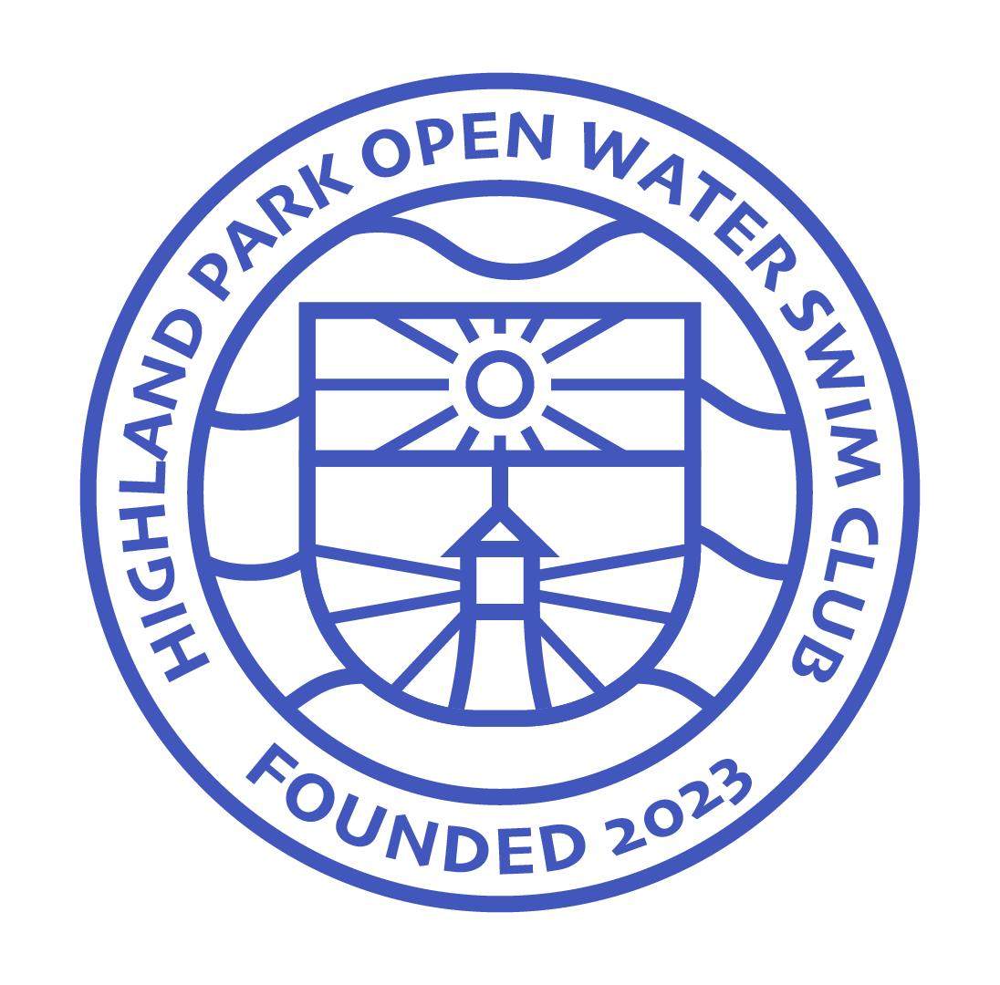

# Welcome!

This is Highland Park Open Water Swim Club (HPOWSC). The official swim club of Highland Park, IL. 

Our Mission: to spread the joy and benefits found in an outdoor fitness lifestyle through open water swimming. What better place than the fresh water of Lake Michigan?

## Meeting times
Standby… HPOWSC will be releasing its summer meeting schedule soon. Until then, start training so you can keep up with the pack. 

## Leadership

HPOWSC was founded by two Highland Park High School students:

Doug Anderson - Class of 2024

Luke Rhoads - Class of 2024

## Liability
HPOWSC is “swim at your own risk.” Participants must be at least 18 years of age or accompanied by an adult. 

Contact: coming soon!

